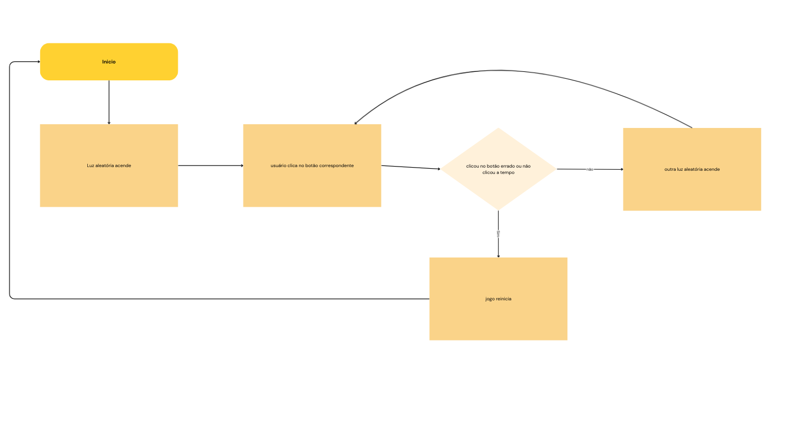

# Documento de Projeto: Twister no arduino

**Equipe:**
* Alyson M. - Engenheiro de Hardware
* Kathrein P. - Engenheira de Hardware
* Clara B. - Gerente de documentação
* Guilherme P. - Designer e Engenheiro de Software
* Carlos M. - Banco/teste
* José L. - Banco
* João D. - pesquisador/teste

**Data:** 13/08/2025
**Versão:** 1.0

---

### 1. Resumo do Projeto
*Twister se tornou um jogo muito popular ao longo dos anos, o jogo consiste em girar uma roleta e colocar os pés ou as mãos na cor que a roleta indicou. Nosso projeto consiste em ser uma versão menor desse famoso jogo, com ele queremos fazer o dia das pessoas mais divertido.*

*Planejamos, também, fazer um estudo sobre o comportamento competitivo da humanidade, então queremos fazer dois projetos para contar os pontos individualmente e colocar um placar, exibido quando todo o projeto estiver em funcionamento no dia da Etec Aberta.*

### 2. Objetivos
* **Objetivo Principal:** Desenvolver um sistema imitando o jogo Twister em escala pequena
* **Objetivos Secundários:**
    * Fazer um segundo sistema, criando um modo multijogador

### 3. Justificativa e Relevância
*o entretenimento é algo muito importante para o ser humano, por isso, nosso projeto traz isso para a comunidade, pretendemos deixar tudo mais divertido com nosso projeto. Esperamos um impacto muito positivo na vida das pessoas que decidam jogar, também desejamos ajudar na fisioterapia, já que o jogo envolve muito movimento nas mãos*

### 4. Descrição Técnica
* **Funcionamento:**
    *esse projeto irá funcionar com botões coloridos que serão pressionandos quando o led correspondente for aceso, quanto mais botões forem apertados, mais pontos serão somados*

* **Diagrama de Blocos:**
    

* **Esquema Elétrico:**
    *(Insira uma imagem do esquema elétrico do circuito, desenhado em ferramentas como Fritzing ou Tinkercad.)*

### 5. Lista de Materiais e Orçamento

| Componente | Quantidade | Preço Unitário Estimado | Custo Total Estimado |
| :--- | :---: | :---: | :---: |
| kit Arduino iniciante | 1 | R$ 79,90 | R$ 79,90 |
| kit 50 leds sortido | 1 | R$ 22,90 | R$ 22,90 |
| 20 resistores 220 ohms | 1 | R$ 2,84 | R$ 28,35 |
| 10 resistores 10 kohms | 1 | R$0,90 | R$0,90 |
| Push button | 8 | R$0,15 | R$1,20 |
| ... | ... | ... | ... |
| **TOTAL** | | | **R$ 133,25** |

### 6. Cronograma
*(Defina as principais etapas do projeto e os prazos para cada uma. Atribua responsáveis por cada etapa.)*

| Etapa | Responsáveis | Início Previsto | Fim Previsto | Status |
| :--- | :--- | :--- | :--- | :--- |
| Fase 1: Pesquisa e Ideação | Todos | 30/07 | 30/07 | Concluído |
| Fase 2: Documentação e Orçamento | Clara B., Carlos M. e José L. | 13/08 | 14/08 | Concluído |
| Fase 3: Testes | Carlos M. e João D. | 27/08 | DD/MM | Em andamento |
| Fase 4: Aquisição de Material | Carlos M. e José L. | DD/MM | DD/MM | [ ] A Fazer |
| Fase 5: Montagem do Protótipo | Alyson M. e Kathrein P. | DD/MM | DD/MM | [ ] A Fazer |
| ... | ... | ... | ... | ... |

### 7. Riscos e Mitigação
* **Risco:** Algum componente queima durante os testes.
    * **Mitigação:** Comprar um componente reserva se o orçamento permitir. Ter cuidado extra com a voltagem e as conexões elétricas.
* **Risco:** Atraso na entrega dos componentes comprados online.
    * **Mitigação:** Comprar com antecedência e ter um "Plano B" com fornecedores locais, mesmo que um pouco mais caros.

---